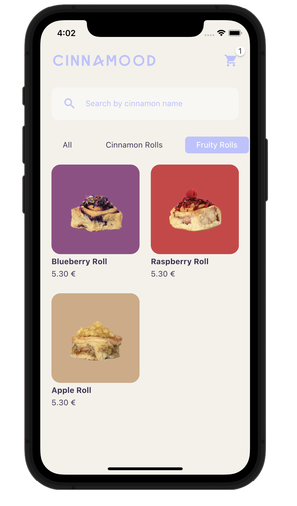
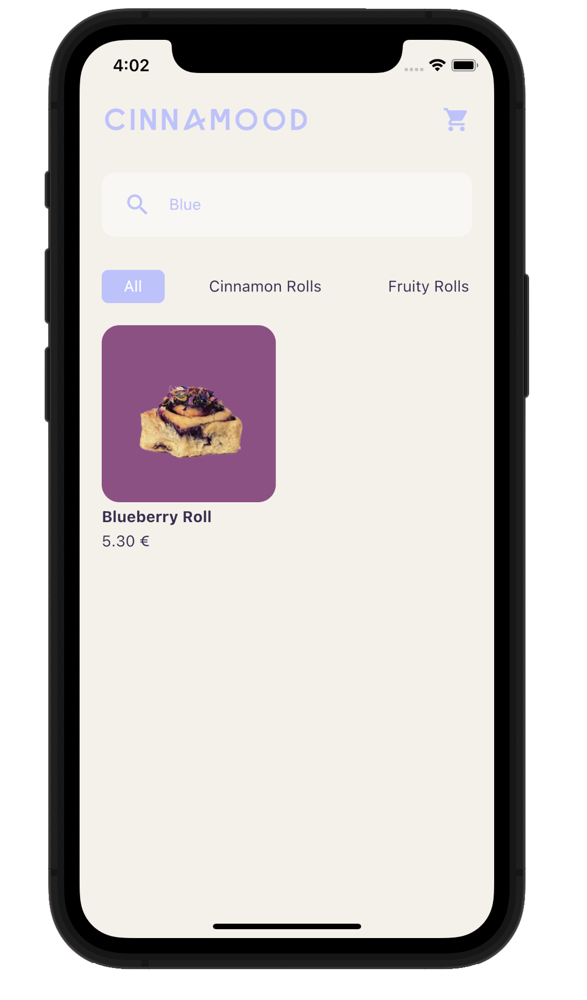
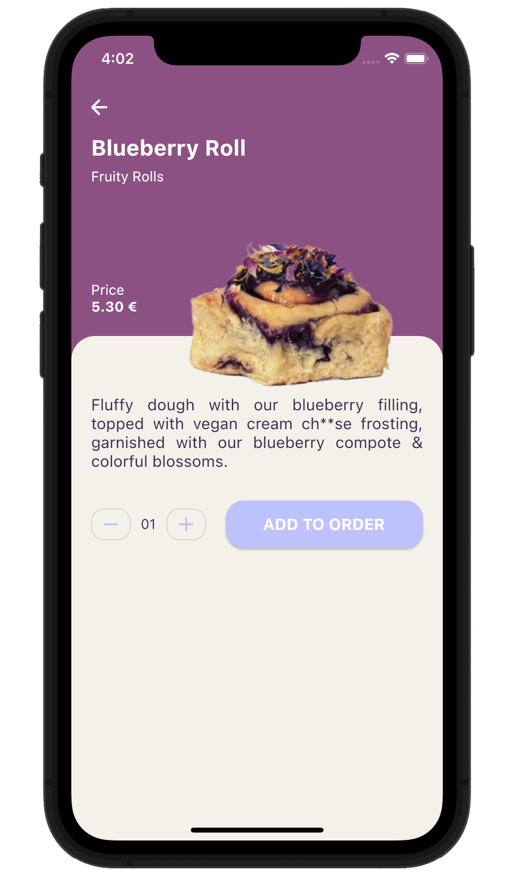
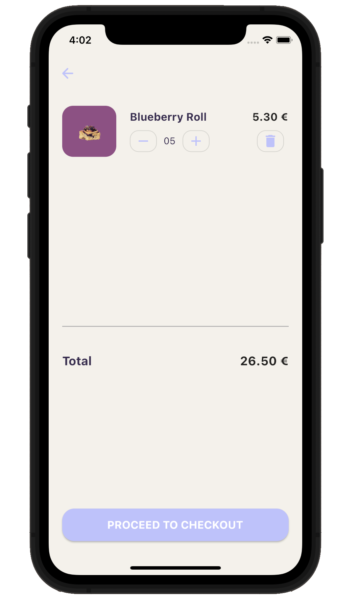

# Cinnamood - Cinnamon Rolls Shop

## Overview

Cinnamood Shop is a delightful Flutter application inspired by the renowned [Cinnamood](https://cinnamood.de) shop in Berlin. 
The app brings the delectable experience of exploring and virtually shopping for mouth-watering cinnamon rolls.
Capturing the essence of the Cinnamood shop, the app features a user-friendly interface, a diverse product catalog, and a dynamic cart system.

## Screenshots

  

 

 

## Features

- **User-Friendly Interface**: Enjoy an intuitive and visually appealing design for a seamless user experience.
- **Product Catalog**: Browse through a diverse range of cinnamon rolls, each with its unique flavor and description.
- **Dynamic Cart System**: Easily manage your cart by adding items, updating quantities, and removing items with convenience.
- **Type Filters**: Explore cinnamon rolls conveniently categorized into "Cinnamon Rolls," "Fruity Rolls," and "Next Level Rolls."
- **Search Functionality**: Quickly find your favorite rolls using the efficient search feature.

## UI Design

The UI design is inspired by [this YouTube video](https://www.youtube.com/watch?v=XBKzpTz65Io).

## Content Attribution

All cinnamon roll images, names, descriptions, and colors are sourced from the official [Cinnamood shop webpage](https://cinnamood.de/en/our-rolls/).

## Technologies Used

- **Flutter**: A powerful UI toolkit for building natively compiled applications for mobile, web, and desktop from a single codebase.
- **Provider Package**: State management library for managing and listening to changes in the app state.
- **Badges Package**: Widget for displaying badges, enhancing the shopping cart icon.
- **Linting**: The codebase adheres to best practices and coding standards using lint rules.
- ~~**Widget Tests**: Extensive use of widget tests to ensure the robustness of the UI components, behaviors, and overall application functionality.~~ (they need to be updated after recent dart upgrade)

## Responsiveness

The app is designed to work seamlessly across various screen sizes, providing a consistent and enjoyable experience on both small and large devices.

## Future Enhancements

- Checkout Process: Implement a complete checkout process for users to finalize their orders.
- User Authentication: Add user authentication for personalized experiences.
- Localization: Support multiple languages for a broader user audience.

